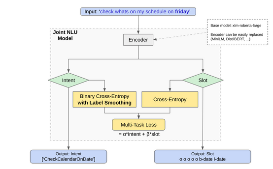

# JointNLU

JointNLU is a Python library for training a Joint Natural Language Understanding (NLU) model using the Hugging Face Transformers library. The Joint NLU model aims to simultaneously perform intent classification and slot filling tasks in a single forward pass.

## JointNLUModel

The `JointNLUModel` is a PyTorch module for the Joint NLU task which uses a pretrained transformer model as its encoder, and includes separate classification layers for intents and slots.

### Architecture

Architecture of JointNLU model:



## Training Model (Script)

In addition to using the `CustomTrainer` class directly in Python, you can train the JointNLU model using the provided `train.py` script. This script simplifies the training process by handling configuration, dataset preparation, and model training in a streamlined manner.

### Steps to Train Using `train.py`

1. **Set Up Configuration**:
   - Prepare a JSON configuration file specifying model parameters, dataset details, and training configurations. The script reads this configuration to set up the model and training process.

2. **Running the Script**:
   - Run the `train.py` script with the path to the configuration file. Optionally, provide a Hugging Face authentication token if you plan to push the model to the Hugging Face Model Hub.

   Example:
   ```bash
   python train.py --config 'config/xlm_r-joint_nlu-massive-en.json' --hf_token 'your_token_here'
   ```

Here, --config points to your JSON configuration file, and --hf_token is used for Hugging Face Hub authentication (optional).

Training Process:

The script will read the configuration, prepare the dataset, and initiate the training process using the CustomTrainer class.
Training progress and metrics are logged, providing insights into the training process.
Pushing to Hugging Face Model Hub:

If push_to_hub is set to True in the configuration file and a Hugging Face token is provided, the trained model and its configuration will be automatically pushed to the specified repository on the Hugging Face Model Hub.
Configuration File
The JSON configuration file should specify key details like model name, dataset IDs, training arguments, etc. Here's an example structure:

```json
{
  "model_name": "xlm-roberta-base",
  "dataset_id": "your_dataset_id",
  "split_ratio": {
    "train": "80%",
    "validation": "10%",
    "test": "10%"
  },
  "trainer_config": {
    "push_to_hub": true,
    "repository_id": "your_repo_name"
  }
  // Other necessary configurations...
}
```

Make sure to customize the configuration file according to your model and dataset requirements.


## Training Model (Library)

To train the model, use the `CustomTrainer` class. This class extends the Hugging Face's Trainer class, customized to compute losses for both intent classification and slot filling tasks. It includes methods to handle the custom data collator and implements hooks for additional functionality during the training process.

```python
from joint_nlu import CustomTrainer, DataCollatorForJointIntentAndSlotFilling

data_collator = DataCollatorForJointIntentAndSlotFilling(tokenizer)
trainer = CustomTrainer(model=model, args=training_args, data_collator=data_collator, ...)
trainer.train()
```

## Model Inference

JointNLU provides a script for running inference using the trained Joint NLU model. This script can work with a local model file or a model hosted on Hugging Face's Model Hub.

### Using the Inference Script

The inference script allows you to input a text phrase and get predictions for intent and slots using a pre-trained JointNLU model.

### Prerequisites

- Ensure you have a trained JointNLU model available either locally or on the Hugging Face Model Hub.
- If using a model from the Hugging Face Model Hub, the script will automatically clone the repository containing the model.

### Running the Script

1. **Clone the Repository (if using Hugging Face Model Hub):**

   The script can automatically clone the model repository from the Hugging Face Hub. Provide the full model name (including the Hugging Face username) as an argument.

   Example:
   ```bash
   python inference.py --model "HF_username/jointnlu-model-name" --text "Your text here"
   ```
2. Use Local Model File:

    If you have a local model file (.pth), provide the path to this file as the model argument.

    Example:
    ```bash
    python inference.py --model "/path/to/jointnlu_model.pth" --text "Your text here"
    ```

### Inference Output

The script outputs the predicted intent and slots for the provided text. For example:

```
Prediction: {'intent': 'BookFlight', 'slots': ['O', 'B-departure_city', 'O', 'B-arrival_city', 'O', 'B-departure_date']}
```

This output indicates the model's predicted intent and the slot labels for each token in the input text.

## Dataset Filtering

JointNLU supports dataset filtering based on specified column values. This feature allows users to include or exclude specific data points from the training process based on the values in certain columns (e.g., scenario or intent).

To use dataset filtering, update the configuration file to include filters for the desired columns. The filters are specified as a dictionary, where keys are column names, and values are lists of accepted values for each column.

```json
{
  "filters": {
    "scenario": ["calendar", "travel"],
    "intent": ["book_flight", "schedule_meeting"]
  }
}
```

In this example, the dataset will be filtered to include only the rows where the scenario column contains either "calendar" or "travel", and the intent column contains either "book_flight" or "schedule_meeting".

## Pushing to Hugging Face Hub

To enable easy sharing and deployment of your trained Joint NLU model, our framework supports direct uploading to the Hugging Face Hub. To use this feature, ensure that you have git-lfs installed and that you are logged in to the Hugging Face Hub.

In your training configuration (config.json), set the "push_to_hub" option to true under the "trainer" section. This instructs the training script to automatically push your model to the specified repository on the Hugging Face Hub upon successful training and evaluation.

```json
"trainer": {
    ...
    "push_to_hub": true
    ...
}
```

When this option is enabled, and provided you have sufficient permissions for the specified repository, the model will be pushed to the Hugging Face Hub at the end of the training process. This facilitates easy access, version control, and sharing of your NLU model within the community.

### Temporary Authentication Method

**Warning:** The following method involves using an environment variable to pass your Hugging Face token. This method should be considered temporary and may not be the safest option. Ensure your development environment is secure before using this approach. A more secure implementation will be provided in future updates.

To push models to the Hugging Face Hub using an environment variable, follow these steps before running train.py script.

```python
import os
from huggingface_hub import notebook_login, HfFolder

notebook_login()
token = HfFolder.get_token()
os.environ['HF_TOKEN'] = token
```

Run the train.py script normally. The script will automatically use the token from the environment variable for authentication when pushing the model to the Hugging Face Hub.

Note: This method currently places the responsibility of token security on the user. It's recommended to use this method only if you are confident in the security of your development environment.
